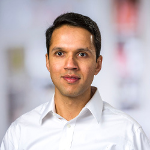
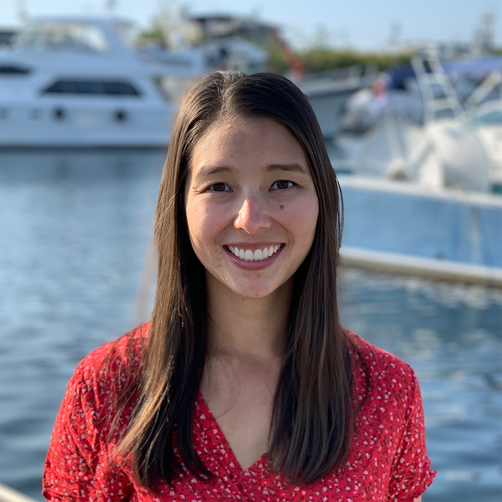
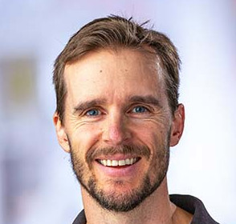
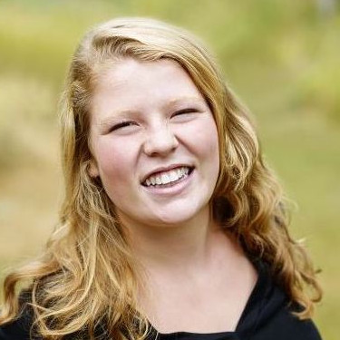
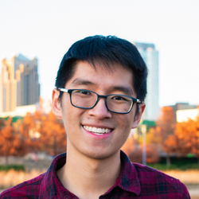
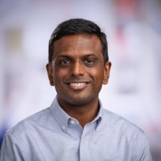

### MCB 536

## Tools for Computational Biology

---

## Today's objectives

- Locate information relevant to the course (lecture materials, assessment, communication streams)
- Identify range of skills and concepts covered in this course

---

## Communication

Slack Workspace: TFCB2026 (see Canvas for invite link)

- #lectures-homeworks: questions about course content and help for homework
- See [Canvas](https://canvas.uw.edu/courses/1920109) for the Zoom meeting link

---

## Today's instructor

- Rasi Subramaniam
- Professor in Basic Sciences & Computational Biology @FredHutch
- Research Area: mRNA Translation
- https://rasilab.github.io

---

## Teaching assistant & office hours

- [Val Browning](https://sites.uw.edu/vasquezlab/people/val/)
- Office hours and location: to be announced
- Check Canvas and Slack for updates

---

## Instructors

<table>
<tr>
<td>

</td>
<td>

</td>
<td>

</td>
</tr>
<tr>
<td>
Melody Campbell
</td>
<td>
Phil Bradley
</td>
<td>
Maggie Russell
</td>
</tr>
<tr>
<td>

</td>
<td>

</td>
<td>

</td>
</tr>
<tr>
<td>
Matthew Chan
</td>
<td>
Manu Setty
</td>
<td>
Rasi Subramaniam
</td>
</tr>
</table>

<a href="https://matsen.fredhutch.org/">Erick Matsen</a> ·
<a href="https://jsb-lab.org/people/bo-yuan/">Bo Yuan</a> 
<a href="https://jsb-lab.org/people/siyuan-chen/">Siyuan Chen</a> ·
<a href="https://jsb-lab.org/people/chandra-sekhar-mukherjee/">Chandra Sekhar Mukherjee</a>

---

## Introduce yourself!

- Name
- Research interests (type of data, model organism, research questions, etc)
- Programming background (Python, R, Unix/Bash, etc.)
- What are you hoping to get out of this course?

---

## Course objectives

By the end of the course, you should be able to:

- Use VSCode to program in Unix/Bash shell, Python, R using appropriate syntax and code convention

- Apply good practices for computational research including project and data organization

- Select appropriate tools to perform specific programming and data analysis tasks

- Analyze common forms of data generated by molecular biology experiments such as flow cytometry, 96-well plate readers, and high throughput sequencing.

---

## What you won't be able to do

- Use ALL of the computational tools your research will require

- Know the best algorithm or analysis method for a specific research question

- Code with expert-level skills

... but you should be equipped to work towards these goals on your own.

<!-- 
- Learn outside class. You will get most benefit if you spend time studying on your own on the internet.
- Learning curve will be steep. Your ability to do things will be limited for a while. This is quite normal.
- You are really learning a new language and also a new way of thinking about problems and solving them. So it will take time to get comfortable.
- Think of this class as a rapid tour through Africa or Europe or South America where everyone speaks a different language than you. You can appreciate what is there, but to be comfortable or get really good, you need to spend lot of time immersed in that culture. 
-->

---

## Course website

You will find syllabus, lectures, homeworks

https://github.com/FredHutch/tfcb_2026

Tuesday and Thursday, 3:30–4:50 PM Pacific, October 1–December 8, 2026  
Fred Hutch, B1-072

**Repo is updated just before lectures, make sure to ‘*pull*’ changes**

---

## Homeworks

Submit through <a href="https://canvas.uw.edu/courses/1920109">Canvas</a>   
MCB 536 A Au 26
Tools For Computational Biology

Eight assignments (10% each) + [participation](./participation_rubric.md) (20%)

---

## Before next class

- Attempt the required [software installation](../../software/README.md) before October 6 and bring your laptop and questions. Lecture 2 is dedicated to installation and troubleshooting.
